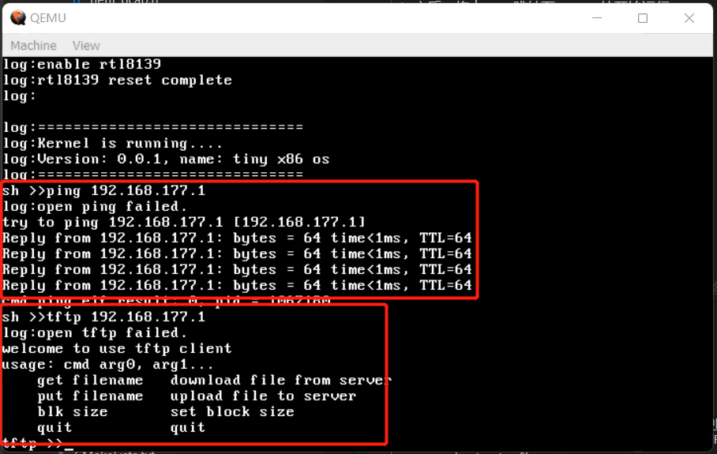

# x86os-with-net

#### 介绍
本项目实现了一个在qemu下运行的32位x86操作系统，并且移植了自行开发的TCP/IP协议栈，从而可使得该系统具备网络通信功能。

#### 安装教程

1. 工程的编译和调试需要使用到开发x86操作系统相关的工具
2. TCP/IP协议栈的运行，需要底层网卡的支持，此部分配置说明请见目录下的视频和文档说明

#### 使用说明

环境搭建好之后，编译 -> 启动调试即可。

#### 参与贡献

lishutong

#### 特技

1. 操作系统具备完整的TCP/IP通信能力
2. 应用程序可基于socket相关系统调用接口开发网络应用程序
3. 提供了ping和tftp文件传输客户端的实现
4. 使用的网卡型号为RTL8139
